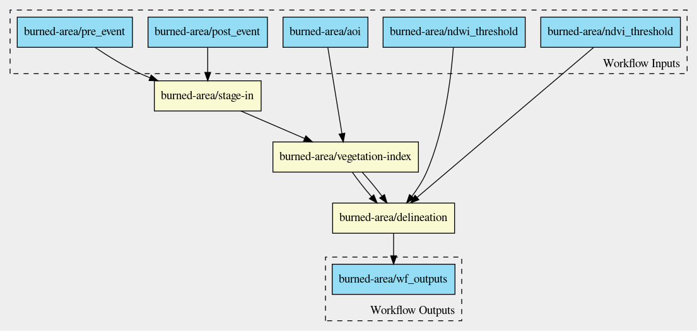

# Application chaining

This repository demonstrates application chaining as a combination of Jupyter notebook based applications and Application Packages that link Docker Containers with arbitrary applications.

The processing scenario is:

- stage-in a pairs of EO products, pre- and post-event
- process three vegetation indexes: NDVI, NDWI and NBR
- process the burned area delineation products: NDVI/NDWI thresholds and RBR

The overall workflow is shown below:

### First step: stage-in Sentinel-2 Level-2A acquisitions

Stage-in the pre- and post event acquisitions with the `stage-in` docker that takes as input a catalog entry reference

And produces as output:

- a local STAC catalog with a single collection and items whose assets point to the local staged bands (e.g. 'red', 'nir', 'swir16', 'swir22')

### Second step: vegetation index

The second step produces the vegetation indexes NDVI, NDWI and NBR. It takes as input the local STAC catalog.

This step produces as output:

- a local STAC catalog with a single item whose assets point to the 'NDVI', 'NDWI' and 'NBR' assets

The Jupyter Notebook git repository is available at https://github.com/terradue-ogc-tb16/vegetation-index

Its docker git repository is available at https://github.com/terradue-ogc-tb16/docker-vegetation-index

### Third step - burned area delineation

This step takes as input a local STAC catalog with STAC catalog with a single item whose assets point to the 'NDVI', 'NDWI' and 'NBR' assets to produce a bitmask for the burned area based on the NDVI and NDWI thresholds and the Relativized Burn Ratio, an indicator of the burned area intensity .

This step produces as output:

- a local STAC catalog with a single item whose assets point to the NDVI/NDWI threshold and normalized burn ratio assets

The Jupyter Notebook git repository is available at https://github.com/terradue-ogc-tb16/burned-area-delineation

Its docker git repository is available at https://github.com/terradue-ogc-tb16/docker-burned-area-delineation

### Chaining strategy

It provides two methods:

#### Using a Jupyter Notebook 

This method relies on using a Notebook to drive the application chaining in which the code cells define the inputs for each of the applications being chained, invokes the application execution and parses the results used as inputs for the next application in the chain.

The application chaining Notebook prepares the inputs and parameters for executing the three CWL scripts and parses the outputs for the next step in the chaining.

The Jupyter Notebook is thus used to orchestrate the `cwltool` invoking the steps.

Applications to be chained in this scenario are a combination of Jupyter notebook based applications and Application Packages expressed as CWL that read a STAC local catalog and produce a local STAC catalog.

#### Using CWL

This method relies on using a CWL workflow to chain the applications and script its execution.

## Applications execution

The applications are executed in Docker containers. These docker containers were built a tool called `repo2cli` that takes a remote git repository, creates the conda environment and create a CLI utility to execute the notebook using the Jupyter Notebook APIs (nbconvert).

This tool is available at: https://github.com/terradue-ogc-tb16/repo2cli and its docker at https://github.com/terradue-ogc-tb16/docker-repo2cli